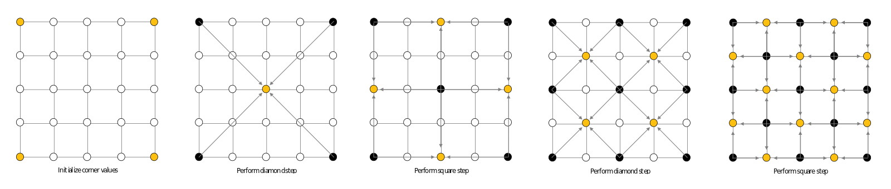
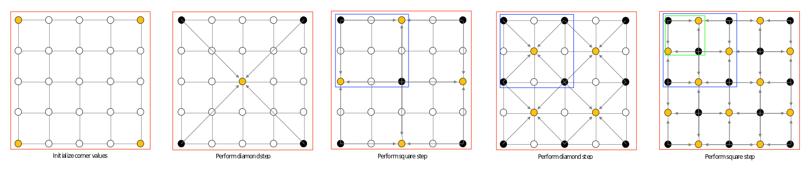
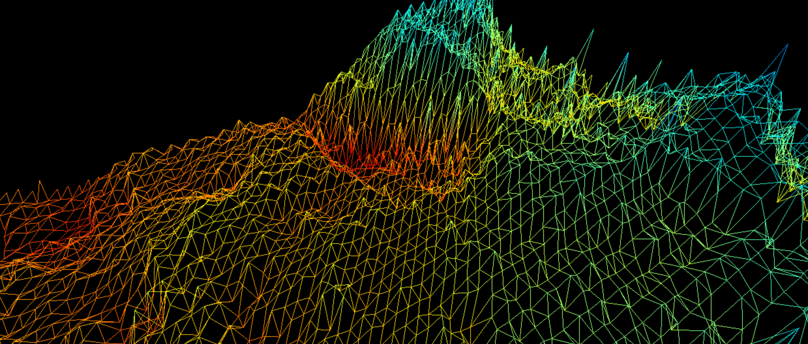
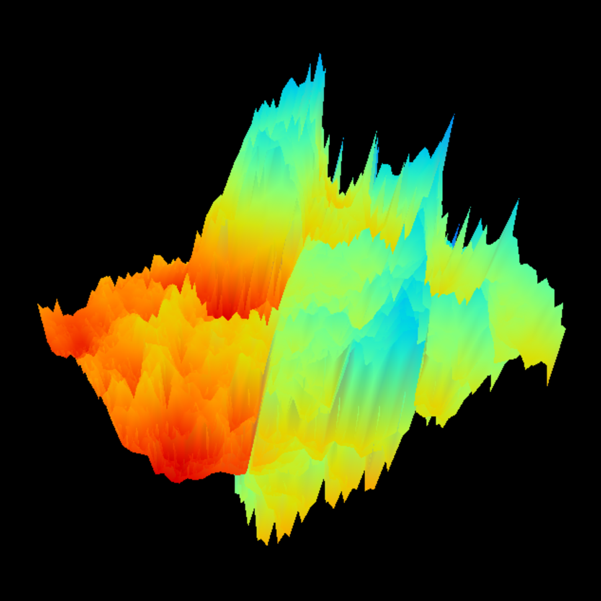
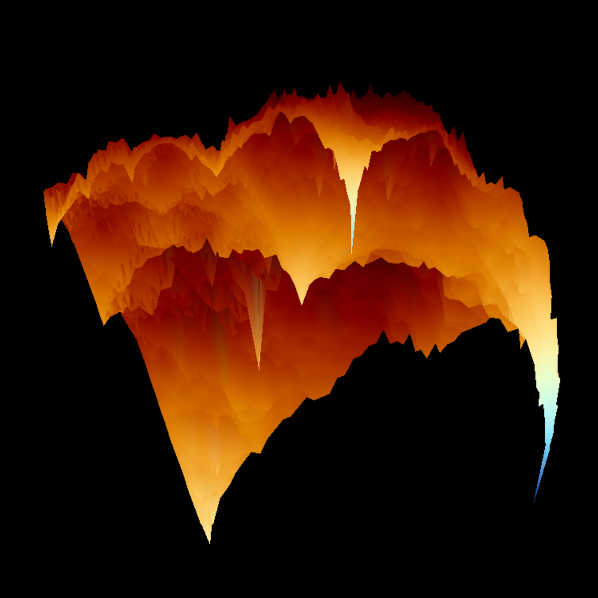

**[View this project on Github](https://github.com/Blakemcw/mountains)**

A while ago I came across the [Diamond-Square Algorithm](https://en.wikipedia.org/wiki/Diamond-square_algorithm) and wanted to create my own implementation. The algorithm was invented by Loren Carpenter, a co-founder of Pixar, in the 1980s for a short film showcasing computer generated landscapes. I've always been interested in procedurally generated graphics and I figured that a good way to get my feet wet would be by learning from one of the greats. The steps to Carpenter's algorithm are fairly straightforward and result in pretty realistic looking mountainous landscapes. The steps are summarized succinctly in this image from the previously linked Wikipedia article.

Carpenter's aformentioned work was created after reading [Mandelbrot's](https://en.wikipedia.org/wiki/Benoit_Mandelbrot#Developing_%22fractal_geometry%22_and_the_Mandelbrot_set) book, _Fractals: Form, Chance, and Dimension_. Looking at the algorithm from his frame of reference, through the idea of using fractals to model nature, we can compare it to attributes that fractals have. [Self-similarity](https://en.wikipedia.org/wiki/Self-similarity) seems to apply to the shape of a mountain, where each piece of a mountain is a mountain itself. Smaller and smaller squares are created until a stopping point is reached, namely the point in which the distance bewteen two corners of a square is 1. To show the self-similarity of the steps I've hightlighted one arm of the algorithm with different colored outlines.

Recognizing the repetive nature of the algorithm lead me to believe that a recursive approach was best. I believe that this helped me in terms of readablity as each step from the picture above was able to be abstracted into its own function. The normal risks of running out of stack space dont apply here as the depth of our algorithm will never exceed `log_2(2^n+1)`. 

The alternative to using recursion would be setting the corners of each square and diamond iteratively, which trades readability for less lines of code. In the iterative approach most of the work can be done inside a single function.

Regardless of what path is taken the results come out the same. Some of the results that my program produced can be seen below!

## Images

    

        
    

    

        
    

