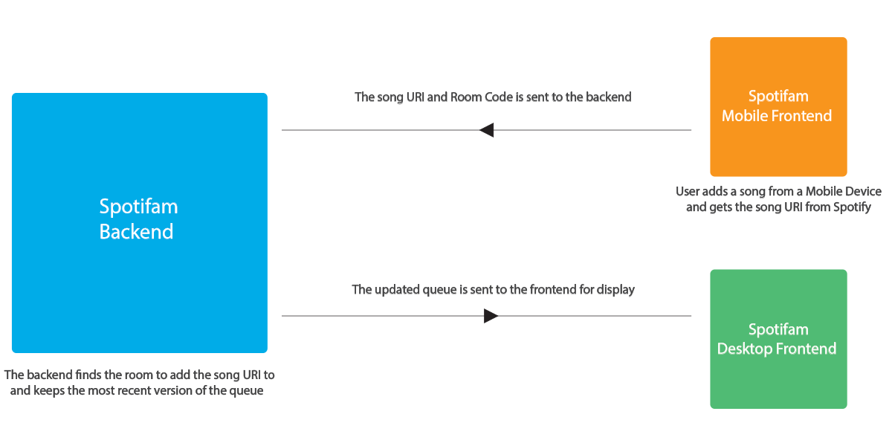
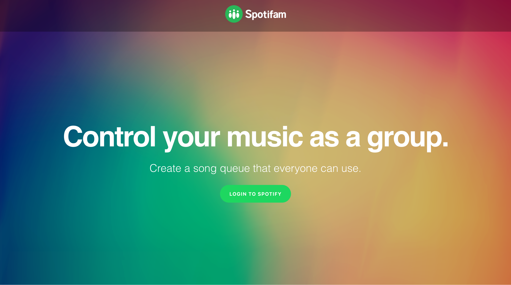
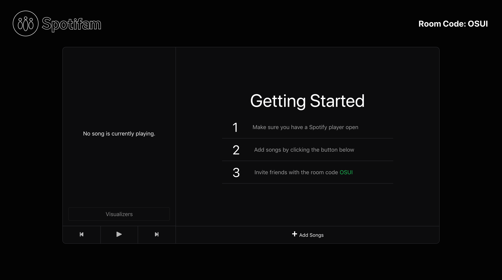
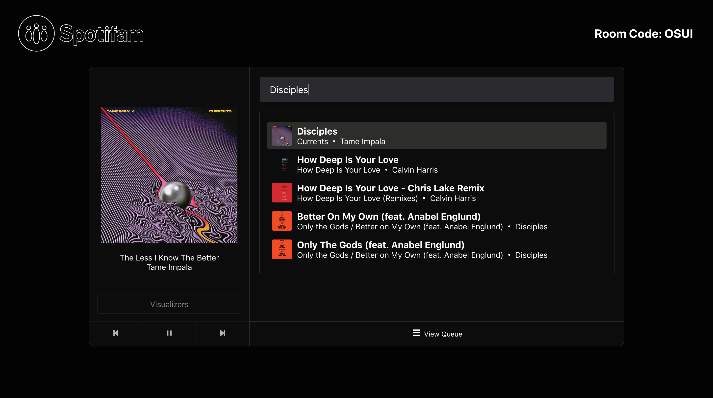
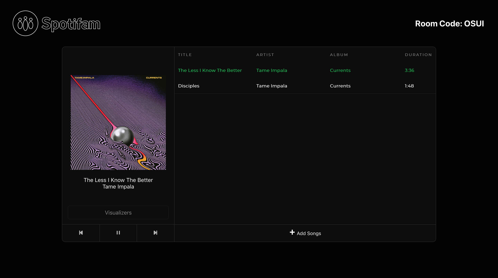

    <a href="https://spotifam.com">Spotifam</a> 
    <a href="https://github.com/Spotifam/spotifam-frontend">Spotifam Frontend on Github</a> 
    <a href="https://github.com/Spotifam/node-backend">Spotifam Backend on Github</a>

 

Over the course of two months, myself and a team of five others, worked on an application called [Spotifam](https://spotifam.com/), a communal queue extension for Spotify. The original goal for the project was to make a group listening experience where hosts of a party could create a room then allow users to join and add music from their phones using a four-letter code.

## Planning

The first stage of creating Spotifam involved getting a big-picture of what our application was meant to be. As a team, we focused on creating user stories that would help us decide what a minimum viable product would look like. Some examples of stories we discussed were,

- ”As a host I should be able to play songs from the browser”
- ”As a guest I should be able to add songs to the queue from my phone”
- ...

This gave us a clear idea of the direction we wanted to take the application in. Once we finished breaking these into tasks and adding them to the project backlog, we began planning our first sprint. To get an idea of our process you can see a full listing of our [documentation](https://github.com/Spotifam/spotifam-documentation).

From there it was all about dividing up work and checking in with the Spotify API Documentation to see what was possible.

## Backend Architecture

Our architecture can be broken down into three different categories: [user authentication](https://developer.spotify.com/documentation/general/guides/authorization-guide/), calls to [Spotify's API](https://developer.spotify.com/documentation/web-api/), and managing the queue on our end. All of these are implemented with an Node/ExpressJS backend.

In this section I'll mainly focus on the implementation of the queue system on our end. Our initial plan was to make all calls on the frontend at constant intervals set by a timer. While this approach worked, it was resource intensive. Every `n` seconds a call would be made to retrieve the up-to-date queue from the backend, even if there weren't any changes. It led to a less than snappy experience for the host room too. Songs would be added in a frenzy all at once if there were multiple additions at the same time. It had no effect on the usability of the app but I always liked the idea of near-instant updates streaming in one-by-one.

After work on the project slowed and all of our goals were met, we disbanded. Recently I came back to the project to fix the way our frontend makes API calls and improve its efficiency. The main issue was the payload of the queue being passed down from the backend constantly. I wanted the backend to decide when the queue should be sent instead of the frontend so I opted for using [socket.io](https://socket.io/) to trigger whenever songs were added on the mobile frontend. The diagram below shows how queue updates are now handled.

This change allows us to remove some calls from the timer saving on some resource intensive communication between the front and back ends. While I would like to extrapolate this model to our other API calls, anything on Spotify's end cant be changed. This means things like checking for the playback status of the current song on an interval are here to stay.

## Images

<!--Images Row 1-->

    

        
         <h6>Homepage</h6>
    

    

        
        <h6>Host Room</h6>
    

<!--Images Row 2-->

    

        
        <h6>Adding Songs<h6>
    

    

        
        <h6>Song Added<h6>
    

